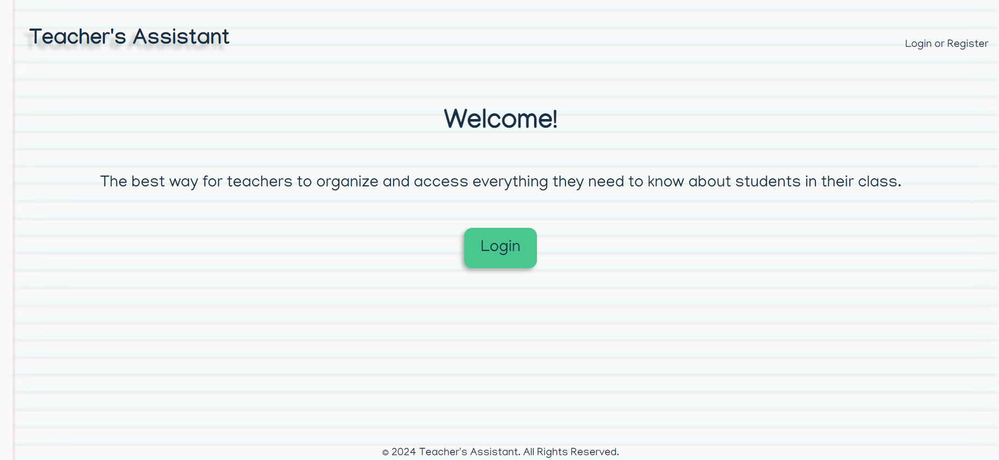
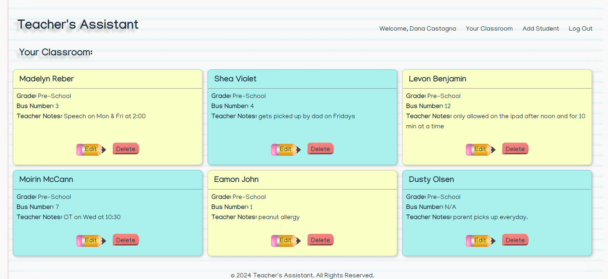

# teachers_assistant_project2
Christian Yanez's draft/Alisha modified

# Table of Contents:

  - [Description](#description)
  - [Installation](#installation)
  - [Technology Used](#technology-used)
  - [Test Instructions](#test-instructions)
  - [Useage](#useage)
  - [Contributions](#contributing)
  - [License](#license)

  ## Description
  The purpose of this project is to create a full-stack application that allows teachers to manage student information, including adding, updating, deleting, and viewing student records. This will allow teacher to more easily track their student's progress during the curriculum. Once the teacher registers on the landing page, they are redirected to Student Menu, where they can view all of the current registered students with a tab of options on the left.

  These options include:
    Adding a Student.
    Updating a Student's info.
    Deleting a Student's info.
    Viewing all Students.

  When adding a new student, teachers will have to fill out a form with the following:

  The Student element has the following parameters:
    First name,
    Last name,
    Birthdate,
    Grade Level,
    Bus number,
    IEP boolean,
    Behavior Plan boolean,
    1:1 aide,
    Aide name (If previous question was true),
    Allergies

  This information will be easily viewable by the teacher once the information is inserted.

  ## Installation
  1. Clone the repository:
    git clone https://github.com/nadavgl/teachers_assistant_project2

  2. Navigate to the project directory: 
    cd teachers_assistant_project2

  3. Install the dependencies:
    npm install

  4. Set up the database:
    Ensure you have PostgresSQL installed and running.
    Create a `.env` file in the root of your project with your database credentials.

  5. Run the application:
    npm start
  ## Technology Used
  Node.js: JavaScript runtime
  Express.js: Web framework for Node.js
  PostgreSQL: Relational database
  Sequelize: ORM for PostgreSQL
  Handlebars.js: Template engine
  DBeaver: Database management tool for testing
  
  ## Test Instructions
  npm run seed

  ## Usage
  To use the application, navigate to the landing page, register as a new teacher or log in if you already have an account. Once logged in, you will be able to view, add, update, delete student records and manage their grades from your dashboard.

  1. Register: Teachers register on the landing page.
  2. Login: After registration, teachers can log in to access the Student Menu.
  3. Student Menu: Teachers can:
    View all registered students.
    Add new students using a form.
    Update existing student information.
    Delete student information.

   
   

  ## Contributing:
  Contributions are welcome! Please follow these steps:
    Fork the repository.
    Create a new branch (`git checkout -b feature-branch`).
    Make your changes and commit them. (`git commit -m 'Add some feature'`).
    Push to your branch (`git push origin feature-branch`).
    Open a pull request.

  ## License
  This project is licensed under the MIT License.
  
  
